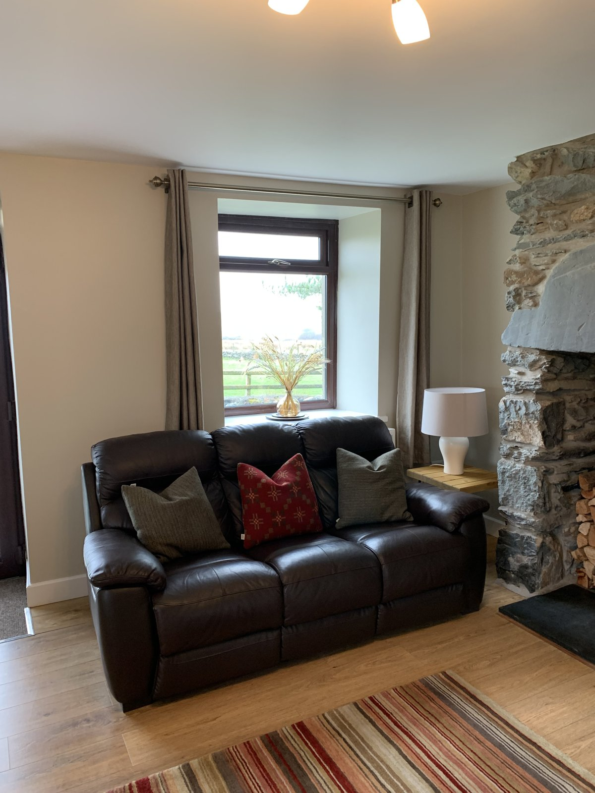

# Bryn-Weirglodd website

A simple, responsive one-page website for Bryn-Weirglodd, a farmhouse holiday home in Cwmystradllyn, Garndolbenmaen, Gwynedd LL51 9AZ.

Plain HTML, CSS and a little JavaScript. No build step, no dependencies. Open `index.html` in a browser to preview it.

## Structure

```
index.html        the page
css/style.css     all styling
js/main.js        photo viewer, maps button, footer year
images/           photos and favicon
.nojekyll         tells GitHub Pages to serve files as-is
```

## Adding the photos

The page expects these files in `images/`. Until a photo is added, its slot shows a neutral tile with a caption, so the page never looks broken.

| File | Shows |
| --- | --- |
| `hero.jpg` | Main banner: the house in the valley (landscape, at least 2000px wide) |
| `exterior-1.jpg` | The farmhouse from the garden (large first tile) |
| `view-1.jpg` | View down the valley |
| `kitchen.jpg` | Kitchen-diner |
| `bedroom-ground.jpg` | Ground-floor twin bedroom |
| `garden.jpg` | Private garden |

Tips: landscape photos work best. Resize to about 1600px on the long edge (2000px for `hero.jpg`) and keep each file under ~400 KB. To add, remove or reorder photos, edit the `<ul class="gallery">` list in `index.html`; the alt text doubles as the caption.

The living room, wet room, double bedroom and family bathroom don't have gallery tiles yet — their `<li>` entries were removed rather than left as placeholders, since the page has no photos for them. Their room descriptions are still on the page in the "The house" and "Facilities" sections. To add a tile back once you have a photo, copy the markup pattern of an existing tile in the `<ul class="gallery" id="gallery-grid">` list in `index.html`, for example:

```html
<li><button type="button"></button></li>
```

using the filename and alt text that fits the new photo (`wet-room.jpg`, `bedroom-double.jpg` and `bathroom.jpg` for the others), then save the photo into `images/` at about 1600px on the long edge and under ~400 KB.

The gallery also carries extra photos beyond the table above — the mill ruins, sheep and lambs by the gate with the mill ruins behind, the farmhouse from the lane, the entrance sign, the front of the house, a valley view from the bench, the welcome hamper, a sheep at the wall, and potted daffodils. Add, remove or reorder any of these the same way, by editing the `<ul class="gallery">` list.

Only use photos the owner holds the rights to.

## Deploying

Any static host works: upload the folder as-is.

- **GitHub Pages:** repository Settings → Pages → Deploy from a branch → `main` / root.
- **Netlify / Cloudflare Pages:** connect the repository, leave the build command empty, publish directory `/`.
